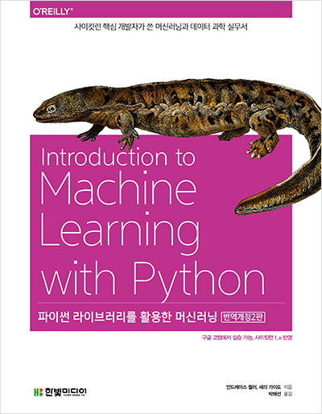

# Machine Learning Notes (Auto TOC)

- GitHub: https://github.com/tjdux/Introduction-to-Machine-Learning-with-Python

## 📓 Notebooks

- **[01 소개.ipynb](https://github.com/tjdux/Introduction-to-Machine-Learning-with-Python/blob/main/01%20%EC%86%8C%EA%B0%9C.ipynb)**
    - [왜 머신러닝인가?](https://github.com/tjdux/Introduction-to-Machine-Learning-with-Python/blob/main/01%20%EC%86%8C%EA%B0%9C.ipynb#왜-머신러닝인가)
      - [머신러닝으로 풀 수 있는 문제](https://github.com/tjdux/Introduction-to-Machine-Learning-with-Python/blob/main/01%20%EC%86%8C%EA%B0%9C.ipynb#머신러닝으로-풀-수-있는-문제)
        - [지도 학습 (supervised learning)](https://github.com/tjdux/Introduction-to-Machine-Learning-with-Python/blob/main/01%20%EC%86%8C%EA%B0%9C.ipynb#지도-학습-supervised-learning)
        - [비지도 학습 (unsupervised learning)](https://github.com/tjdux/Introduction-to-Machine-Learning-with-Python/blob/main/01%20%EC%86%8C%EA%B0%9C.ipynb#비지도-학습-unsupervised-learning)
      - [문제와 데이터 이해하기](https://github.com/tjdux/Introduction-to-Machine-Learning-with-Python/blob/main/01%20%EC%86%8C%EA%B0%9C.ipynb#문제와-데이터-이해하기)
    - [왜 파이썬인가?](https://github.com/tjdux/Introduction-to-Machine-Learning-with-Python/blob/main/01%20%EC%86%8C%EA%B0%9C.ipynb#왜-파이썬인가)
    - [scikit-learn](https://github.com/tjdux/Introduction-to-Machine-Learning-with-Python/blob/main/01%20%EC%86%8C%EA%B0%9C.ipynb#scikit-learn)
      - [scikit-learn 설치](https://github.com/tjdux/Introduction-to-Machine-Learning-with-Python/blob/main/01%20%EC%86%8C%EA%B0%9C.ipynb#scikit-learn-설치)
    - [필수 라이브러리와 도구들](https://github.com/tjdux/Introduction-to-Machine-Learning-with-Python/blob/main/01%20%EC%86%8C%EA%B0%9C.ipynb#필수-라이브러리와-도구들)
      - [주피터 노트북](https://github.com/tjdux/Introduction-to-Machine-Learning-with-Python/blob/main/01%20%EC%86%8C%EA%B0%9C.ipynb#주피터-노트북)
      - [NumPy](https://github.com/tjdux/Introduction-to-Machine-Learning-with-Python/blob/main/01%20%EC%86%8C%EA%B0%9C.ipynb#numpy)
      - [SciPy](https://github.com/tjdux/Introduction-to-Machine-Learning-with-Python/blob/main/01%20%EC%86%8C%EA%B0%9C.ipynb#scipy)
      - [matplotlib](https://github.com/tjdux/Introduction-to-Machine-Learning-with-Python/blob/main/01%20%EC%86%8C%EA%B0%9C.ipynb#matplotlib)
      - [pandas](https://github.com/tjdux/Introduction-to-Machine-Learning-with-Python/blob/main/01%20%EC%86%8C%EA%B0%9C.ipynb#pandas)
    - [첫 번째 애플리케이션: 붓꽃의 품종 분류](https://github.com/tjdux/Introduction-to-Machine-Learning-with-Python/blob/main/01%20%EC%86%8C%EA%B0%9C.ipynb#첫-번째-애플리케이션-붓꽃의-품종-분류)
      - [데이터 적재](https://github.com/tjdux/Introduction-to-Machine-Learning-with-Python/blob/main/01%20%EC%86%8C%EA%B0%9C.ipynb#데이터-적재)
      - [성과 측정: 훈련 데이터와 테스트 데이터](https://github.com/tjdux/Introduction-to-Machine-Learning-with-Python/blob/main/01%20%EC%86%8C%EA%B0%9C.ipynb#성과-측정-훈련-데이터와-테스트-데이터)
      - [가장 먼저 할 일: 데이터 살펴보기](https://github.com/tjdux/Introduction-to-Machine-Learning-with-Python/blob/main/01%20%EC%86%8C%EA%B0%9C.ipynb#가장-먼저-할-일-데이터-살펴보기)
      - [첫 번째 머신러닝 모델: k-최근접 이웃 알고리즘 (k-NN)](https://github.com/tjdux/Introduction-to-Machine-Learning-with-Python/blob/main/01%20%EC%86%8C%EA%B0%9C.ipynb#첫-번째-머신러닝-모델-k-최근접-이웃-알고리즘-k-nn)
      - [예측하기](https://github.com/tjdux/Introduction-to-Machine-Learning-with-Python/blob/main/01%20%EC%86%8C%EA%B0%9C.ipynb#예측하기)
      - [모델 평가하기](https://github.com/tjdux/Introduction-to-Machine-Learning-with-Python/blob/main/01%20%EC%86%8C%EA%B0%9C.ipynb#모델-평가하기)

- **[02_3_지도학습_알고리즘.ipynb](https://github.com/tjdux/Introduction-to-Machine-Learning-with-Python/blob/main/02_3_%EC%A7%80%EB%8F%84%ED%95%99%EC%8A%B5_%EC%95%8C%EA%B3%A0%EB%A6%AC%EC%A6%98.ipynb)**
    - [01 예제에 사용할 데이터셋](https://github.com/tjdux/Introduction-to-Machine-Learning-with-Python/blob/main/02_3_%EC%A7%80%EB%8F%84%ED%95%99%EC%8A%B5_%EC%95%8C%EA%B3%A0%EB%A6%AC%EC%A6%98.ipynb#01-예제에-사용할-데이터셋)
      - [1.1 분류](https://github.com/tjdux/Introduction-to-Machine-Learning-with-Python/blob/main/02_3_%EC%A7%80%EB%8F%84%ED%95%99%EC%8A%B5_%EC%95%8C%EA%B3%A0%EB%A6%AC%EC%A6%98.ipynb#11-분류)
        - [1.1.1 forge 데이터셋](https://github.com/tjdux/Introduction-to-Machine-Learning-with-Python/blob/main/02_3_%EC%A7%80%EB%8F%84%ED%95%99%EC%8A%B5_%EC%95%8C%EA%B3%A0%EB%A6%AC%EC%A6%98.ipynb#111-forge-데이터셋)
        - [1.1.2 위스콘신 유방암 데이터셋](https://github.com/tjdux/Introduction-to-Machine-Learning-with-Python/blob/main/02_3_%EC%A7%80%EB%8F%84%ED%95%99%EC%8A%B5_%EC%95%8C%EA%B3%A0%EB%A6%AC%EC%A6%98.ipynb#112-위스콘신-유방암-데이터셋)
      - [1.2 회귀 알고리즘](https://github.com/tjdux/Introduction-to-Machine-Learning-with-Python/blob/main/02_3_%EC%A7%80%EB%8F%84%ED%95%99%EC%8A%B5_%EC%95%8C%EA%B3%A0%EB%A6%AC%EC%A6%98.ipynb#12-회귀-알고리즘)
        - [1.2.1 wave 데이터셋](https://github.com/tjdux/Introduction-to-Machine-Learning-with-Python/blob/main/02_3_%EC%A7%80%EB%8F%84%ED%95%99%EC%8A%B5_%EC%95%8C%EA%B3%A0%EB%A6%AC%EC%A6%98.ipynb#121-wave-데이터셋)
        - [1.2.2 보스턴 주택가격 데이터셋](https://github.com/tjdux/Introduction-to-Machine-Learning-with-Python/blob/main/02_3_%EC%A7%80%EB%8F%84%ED%95%99%EC%8A%B5_%EC%95%8C%EA%B3%A0%EB%A6%AC%EC%A6%98.ipynb#122-보스턴-주택가격-데이터셋)
    - [02 k-최근접 이웃](https://github.com/tjdux/Introduction-to-Machine-Learning-with-Python/blob/main/02_3_%EC%A7%80%EB%8F%84%ED%95%99%EC%8A%B5_%EC%95%8C%EA%B3%A0%EB%A6%AC%EC%A6%98.ipynb#02-k-최근접-이웃)
      - [2.1 k-최근접 이웃 분류](https://github.com/tjdux/Introduction-to-Machine-Learning-with-Python/blob/main/02_3_%EC%A7%80%EB%8F%84%ED%95%99%EC%8A%B5_%EC%95%8C%EA%B3%A0%EB%A6%AC%EC%A6%98.ipynb#21-k-최근접-이웃-분류)
        - [scikit-learn에서의 k-최근접 이웃 분류](https://github.com/tjdux/Introduction-to-Machine-Learning-with-Python/blob/main/02_3_%EC%A7%80%EB%8F%84%ED%95%99%EC%8A%B5_%EC%95%8C%EA%B3%A0%EB%A6%AC%EC%A6%98.ipynb#scikit-learn에서의-k-최근접-이웃-분류)
      - [2.2 KNeighborsClassfier 분석](https://github.com/tjdux/Introduction-to-Machine-Learning-with-Python/blob/main/02_3_%EC%A7%80%EB%8F%84%ED%95%99%EC%8A%B5_%EC%95%8C%EA%B3%A0%EB%A6%AC%EC%A6%98.ipynb#22-kneighborsclassfier-분석)
        - [복잡도와 일반화 사이의 관계](https://github.com/tjdux/Introduction-to-Machine-Learning-with-Python/blob/main/02_3_%EC%A7%80%EB%8F%84%ED%95%99%EC%8A%B5_%EC%95%8C%EA%B3%A0%EB%A6%AC%EC%A6%98.ipynb#복잡도와-일반화-사이의-관계)
      - [2.3 k-최근접 이웃 회귀](https://github.com/tjdux/Introduction-to-Machine-Learning-with-Python/blob/main/02_3_%EC%A7%80%EB%8F%84%ED%95%99%EC%8A%B5_%EC%95%8C%EA%B3%A0%EB%A6%AC%EC%A6%98.ipynb#23-k-최근접-이웃-회귀)
        - [scikit-learn에서의 k-최근접 이웃 회귀](https://github.com/tjdux/Introduction-to-Machine-Learning-with-Python/blob/main/02_3_%EC%A7%80%EB%8F%84%ED%95%99%EC%8A%B5_%EC%95%8C%EA%B3%A0%EB%A6%AC%EC%A6%98.ipynb#scikit-learn에서의-k-최근접-이웃-회귀)
      - [2.4 KNeighborsRegressor 분석](https://github.com/tjdux/Introduction-to-Machine-Learning-with-Python/blob/main/02_3_%EC%A7%80%EB%8F%84%ED%95%99%EC%8A%B5_%EC%95%8C%EA%B3%A0%EB%A6%AC%EC%A6%98.ipynb#24-kneighborsregressor-분석)
      - [2.5 장단점과 매개변수](https://github.com/tjdux/Introduction-to-Machine-Learning-with-Python/blob/main/02_3_%EC%A7%80%EB%8F%84%ED%95%99%EC%8A%B5_%EC%95%8C%EA%B3%A0%EB%A6%AC%EC%A6%98.ipynb#25-장단점과-매개변수)
        - [중요한 매개변수](https://github.com/tjdux/Introduction-to-Machine-Learning-with-Python/blob/main/02_3_%EC%A7%80%EB%8F%84%ED%95%99%EC%8A%B5_%EC%95%8C%EA%B3%A0%EB%A6%AC%EC%A6%98.ipynb#중요한-매개변수)
        - [장단점](https://github.com/tjdux/Introduction-to-Machine-Learning-with-Python/blob/main/02_3_%EC%A7%80%EB%8F%84%ED%95%99%EC%8A%B5_%EC%95%8C%EA%B3%A0%EB%A6%AC%EC%A6%98.ipynb#장단점)
    - [03 선형 모델 (linear model)](https://github.com/tjdux/Introduction-to-Machine-Learning-with-Python/blob/main/02_3_%EC%A7%80%EB%8F%84%ED%95%99%EC%8A%B5_%EC%95%8C%EA%B3%A0%EB%A6%AC%EC%A6%98.ipynb#03-선형-모델-linear-model)
      - [3.1 회귀의 선형 모델](https://github.com/tjdux/Introduction-to-Machine-Learning-with-Python/blob/main/02_3_%EC%A7%80%EB%8F%84%ED%95%99%EC%8A%B5_%EC%95%8C%EA%B3%A0%EB%A6%AC%EC%A6%98.ipynb#31-회귀의-선형-모델)
      - [3.2 선형 회귀(최소제곱법) (OLS)](https://github.com/tjdux/Introduction-to-Machine-Learning-with-Python/blob/main/02_3_%EC%A7%80%EB%8F%84%ED%95%99%EC%8A%B5_%EC%95%8C%EA%B3%A0%EB%A6%AC%EC%A6%98.ipynb#32-선형-회귀최소제곱법-ols)
        - [보스턴 주택가격 데이터셋 (고차원 데이터셋)](https://github.com/tjdux/Introduction-to-Machine-Learning-with-Python/blob/main/02_3_%EC%A7%80%EB%8F%84%ED%95%99%EC%8A%B5_%EC%95%8C%EA%B3%A0%EB%A6%AC%EC%A6%98.ipynb#보스턴-주택가격-데이터셋-고차원-데이터셋)
      - [3.3 리지 회귀 (Ridge)](https://github.com/tjdux/Introduction-to-Machine-Learning-with-Python/blob/main/02_3_%EC%A7%80%EB%8F%84%ED%95%99%EC%8A%B5_%EC%95%8C%EA%B3%A0%EB%A6%AC%EC%A6%98.ipynb#33-리지-회귀-ridge)
        - [규제(`alpha`)](https://github.com/tjdux/Introduction-to-Machine-Learning-with-Python/blob/main/02_3_%EC%A7%80%EB%8F%84%ED%95%99%EC%8A%B5_%EC%95%8C%EA%B3%A0%EB%A6%AC%EC%A6%98.ipynb#규제alpha)
      - [3.4 라소 (Lasso)](https://github.com/tjdux/Introduction-to-Machine-Learning-with-Python/blob/main/02_3_%EC%A7%80%EB%8F%84%ED%95%99%EC%8A%B5_%EC%95%8C%EA%B3%A0%EB%A6%AC%EC%A6%98.ipynb#34-라소-lasso)
        - [규제 (`alpha`)](https://github.com/tjdux/Introduction-to-Machine-Learning-with-Python/blob/main/02_3_%EC%A7%80%EB%8F%84%ED%95%99%EC%8A%B5_%EC%95%8C%EA%B3%A0%EB%A6%AC%EC%A6%98.ipynb#규제-alpha)
        - [리지 회귀, 라소 회귀](https://github.com/tjdux/Introduction-to-Machine-Learning-with-Python/blob/main/02_3_%EC%A7%80%EB%8F%84%ED%95%99%EC%8A%B5_%EC%95%8C%EA%B3%A0%EB%A6%AC%EC%A6%98.ipynb#리지-회귀-라소-회귀)
        - [QuantileRegressor](https://github.com/tjdux/Introduction-to-Machine-Learning-with-Python/blob/main/02_3_%EC%A7%80%EB%8F%84%ED%95%99%EC%8A%B5_%EC%95%8C%EA%B3%A0%EB%A6%AC%EC%A6%98.ipynb#quantileregressor)
      - [3.5 분류용 선형 모델](https://github.com/tjdux/Introduction-to-Machine-Learning-with-Python/blob/main/02_3_%EC%A7%80%EB%8F%84%ED%95%99%EC%8A%B5_%EC%95%8C%EA%B3%A0%EB%A6%AC%EC%A6%98.ipynb#35-분류용-선형-모델)
        - [이진 분류 선형 모델 (LogsticRegression, Support Vector Machine)](https://github.com/tjdux/Introduction-to-Machine-Learning-with-Python/blob/main/02_3_%EC%A7%80%EB%8F%84%ED%95%99%EC%8A%B5_%EC%95%8C%EA%B3%A0%EB%A6%AC%EC%A6%98.ipynb#이진-분류-선형-모델-logsticregression-support-vector-machine)
          - [규제 (`C`)](https://github.com/tjdux/Introduction-to-Machine-Learning-with-Python/blob/main/02_3_%EC%A7%80%EB%8F%84%ED%95%99%EC%8A%B5_%EC%95%8C%EA%B3%A0%EB%A6%AC%EC%A6%98.ipynb#규제-c)
          - [유방암 데이터셋 (LogisticRegression)](https://github.com/tjdux/Introduction-to-Machine-Learning-with-Python/blob/main/02_3_%EC%A7%80%EB%8F%84%ED%95%99%EC%8A%B5_%EC%95%8C%EA%B3%A0%EB%A6%AC%EC%A6%98.ipynb#유방암-데이터셋-logisticregression)
        - [다중 클래스 분류용 선형 모델](https://github.com/tjdux/Introduction-to-Machine-Learning-with-Python/blob/main/02_3_%EC%A7%80%EB%8F%84%ED%95%99%EC%8A%B5_%EC%95%8C%EA%B3%A0%EB%A6%AC%EC%A6%98.ipynb#다중-클래스-분류용-선형-모델)
      - [3.6 장단점과 매개변수](https://github.com/tjdux/Introduction-to-Machine-Learning-with-Python/blob/main/02_3_%EC%A7%80%EB%8F%84%ED%95%99%EC%8A%B5_%EC%95%8C%EA%B3%A0%EB%A6%AC%EC%A6%98.ipynb#36-장단점과-매개변수)
        - [매개변수](https://github.com/tjdux/Introduction-to-Machine-Learning-with-Python/blob/main/02_3_%EC%A7%80%EB%8F%84%ED%95%99%EC%8A%B5_%EC%95%8C%EA%B3%A0%EB%A6%AC%EC%A6%98.ipynb#매개변수)
        - [장단점](https://github.com/tjdux/Introduction-to-Machine-Learning-with-Python/blob/main/02_3_%EC%A7%80%EB%8F%84%ED%95%99%EC%8A%B5_%EC%95%8C%EA%B3%A0%EB%A6%AC%EC%A6%98.ipynb#장단점)
      - [SDGClassfier, SDGregressor](https://github.com/tjdux/Introduction-to-Machine-Learning-with-Python/blob/main/02_3_%EC%A7%80%EB%8F%84%ED%95%99%EC%8A%B5_%EC%95%8C%EA%B3%A0%EB%A6%AC%EC%A6%98.ipynb#sdgclassfier-sdgregressor)
    - [04 나이브 베이즈 분류기](https://github.com/tjdux/Introduction-to-Machine-Learning-with-Python/blob/main/02_3_%EC%A7%80%EB%8F%84%ED%95%99%EC%8A%B5_%EC%95%8C%EA%B3%A0%EB%A6%AC%EC%A6%98.ipynb#04-나이브-베이즈-분류기)
      - [장단점과 매개변수](https://github.com/tjdux/Introduction-to-Machine-Learning-with-Python/blob/main/02_3_%EC%A7%80%EB%8F%84%ED%95%99%EC%8A%B5_%EC%95%8C%EA%B3%A0%EB%A6%AC%EC%A6%98.ipynb#장단점과-매개변수)
        - [매개변수](https://github.com/tjdux/Introduction-to-Machine-Learning-with-Python/blob/main/02_3_%EC%A7%80%EB%8F%84%ED%95%99%EC%8A%B5_%EC%95%8C%EA%B3%A0%EB%A6%AC%EC%A6%98.ipynb#매개변수)
        - [장단점](https://github.com/tjdux/Introduction-to-Machine-Learning-with-Python/blob/main/02_3_%EC%A7%80%EB%8F%84%ED%95%99%EC%8A%B5_%EC%95%8C%EA%B3%A0%EB%A6%AC%EC%A6%98.ipynb#장단점)
    - [05 결정 트리 (decesion tree)](https://github.com/tjdux/Introduction-to-Machine-Learning-with-Python/blob/main/02_3_%EC%A7%80%EB%8F%84%ED%95%99%EC%8A%B5_%EC%95%8C%EA%B3%A0%EB%A6%AC%EC%A6%98.ipynb#05-결정-트리-decesion-tree)
      - [5.1 결정 트리 만들기](https://github.com/tjdux/Introduction-to-Machine-Learning-with-Python/blob/main/02_3_%EC%A7%80%EB%8F%84%ED%95%99%EC%8A%B5_%EC%95%8C%EA%B3%A0%EB%A6%AC%EC%A6%98.ipynb#51-결정-트리-만들기)
      - [5.2 결정 트리의 복잡도 제어하기](https://github.com/tjdux/Introduction-to-Machine-Learning-with-Python/blob/main/02_3_%EC%A7%80%EB%8F%84%ED%95%99%EC%8A%B5_%EC%95%8C%EA%B3%A0%EB%A6%AC%EC%A6%98.ipynb#52-결정-트리의-복잡도-제어하기)
      - [5.3 결정 트리 분석](https://github.com/tjdux/Introduction-to-Machine-Learning-with-Python/blob/main/02_3_%EC%A7%80%EB%8F%84%ED%95%99%EC%8A%B5_%EC%95%8C%EA%B3%A0%EB%A6%AC%EC%A6%98.ipynb#53-결정-트리-분석)
      - [5.4 트리의 특성 중요도](https://github.com/tjdux/Introduction-to-Machine-Learning-with-Python/blob/main/02_3_%EC%A7%80%EB%8F%84%ED%95%99%EC%8A%B5_%EC%95%8C%EA%B3%A0%EB%A6%AC%EC%A6%98.ipynb#54-트리의-특성-중요도)
      - [5.5 DecisionTreeRegressor](https://github.com/tjdux/Introduction-to-Machine-Learning-with-Python/blob/main/02_3_%EC%A7%80%EB%8F%84%ED%95%99%EC%8A%B5_%EC%95%8C%EA%B3%A0%EB%A6%AC%EC%A6%98.ipynb#55-decisiontreeregressor)
      - [5.6 장단점과 매개변수](https://github.com/tjdux/Introduction-to-Machine-Learning-with-Python/blob/main/02_3_%EC%A7%80%EB%8F%84%ED%95%99%EC%8A%B5_%EC%95%8C%EA%B3%A0%EB%A6%AC%EC%A6%98.ipynb#56-장단점과-매개변수)
        - [매개변수](https://github.com/tjdux/Introduction-to-Machine-Learning-with-Python/blob/main/02_3_%EC%A7%80%EB%8F%84%ED%95%99%EC%8A%B5_%EC%95%8C%EA%B3%A0%EB%A6%AC%EC%A6%98.ipynb#매개변수)
        - [장단점](https://github.com/tjdux/Introduction-to-Machine-Learning-with-Python/blob/main/02_3_%EC%A7%80%EB%8F%84%ED%95%99%EC%8A%B5_%EC%95%8C%EA%B3%A0%EB%A6%AC%EC%A6%98.ipynb#장단점)
    - [06 결정 트리의 앙상블 (decision tree ensemble)](https://github.com/tjdux/Introduction-to-Machine-Learning-with-Python/blob/main/02_3_%EC%A7%80%EB%8F%84%ED%95%99%EC%8A%B5_%EC%95%8C%EA%B3%A0%EB%A6%AC%EC%A6%98.ipynb#06-결정-트리의-앙상블-decision-tree-ensemble)
      - [6.1 랜덤 포레스트 (Random Forest)](https://github.com/tjdux/Introduction-to-Machine-Learning-with-Python/blob/main/02_3_%EC%A7%80%EB%8F%84%ED%95%99%EC%8A%B5_%EC%95%8C%EA%B3%A0%EB%A6%AC%EC%A6%98.ipynb#61-랜덤-포레스트-random-forest)
        - [랜덤 포레스트 구축](https://github.com/tjdux/Introduction-to-Machine-Learning-with-Python/blob/main/02_3_%EC%A7%80%EB%8F%84%ED%95%99%EC%8A%B5_%EC%95%8C%EA%B3%A0%EB%A6%AC%EC%A6%98.ipynb#랜덤-포레스트-구축)
        - [랜덤 포레스트 분석](https://github.com/tjdux/Introduction-to-Machine-Learning-with-Python/blob/main/02_3_%EC%A7%80%EB%8F%84%ED%95%99%EC%8A%B5_%EC%95%8C%EA%B3%A0%EB%A6%AC%EC%A6%98.ipynb#랜덤-포레스트-분석)
        - [장단점과 매개변수](https://github.com/tjdux/Introduction-to-Machine-Learning-with-Python/blob/main/02_3_%EC%A7%80%EB%8F%84%ED%95%99%EC%8A%B5_%EC%95%8C%EA%B3%A0%EB%A6%AC%EC%A6%98.ipynb#장단점과-매개변수)
      - [6.2 그레이디언트 부스팅 회귀 트리 (gradient boosting)](https://github.com/tjdux/Introduction-to-Machine-Learning-with-Python/blob/main/02_3_%EC%A7%80%EB%8F%84%ED%95%99%EC%8A%B5_%EC%95%8C%EA%B3%A0%EB%A6%AC%EC%A6%98.ipynb#62-그레이디언트-부스팅-회귀-트리-gradient-boosting)
        - [장단점과 매개변수](https://github.com/tjdux/Introduction-to-Machine-Learning-with-Python/blob/main/02_3_%EC%A7%80%EB%8F%84%ED%95%99%EC%8A%B5_%EC%95%8C%EA%B3%A0%EB%A6%AC%EC%A6%98.ipynb#장단점과-매개변수)
    - [07 그 외 다른 앙상블 (ensemble)](https://github.com/tjdux/Introduction-to-Machine-Learning-with-Python/blob/main/02_3_%EC%A7%80%EB%8F%84%ED%95%99%EC%8A%B5_%EC%95%8C%EA%B3%A0%EB%A6%AC%EC%A6%98.ipynb#07-그-외-다른-앙상블-ensemble)
      - [7.1 배깅 (Bagging; Bootstrap aggregating)](https://github.com/tjdux/Introduction-to-Machine-Learning-with-Python/blob/main/02_3_%EC%A7%80%EB%8F%84%ED%95%99%EC%8A%B5_%EC%95%8C%EA%B3%A0%EB%A6%AC%EC%A6%98.ipynb#71-배깅-bagging-bootstrap-aggregating)
      - [7.2 엑스트라 트리 (Extra-Trees)](https://github.com/tjdux/Introduction-to-Machine-Learning-with-Python/blob/main/02_3_%EC%A7%80%EB%8F%84%ED%95%99%EC%8A%B5_%EC%95%8C%EA%B3%A0%EB%A6%AC%EC%A6%98.ipynb#72-엑스트라-트리-extra-trees)
      - [7.3 에이다 부스트 (AdaBoost; Adaptive Boosting)](https://github.com/tjdux/Introduction-to-Machine-Learning-with-Python/blob/main/02_3_%EC%A7%80%EB%8F%84%ED%95%99%EC%8A%B5_%EC%95%8C%EA%B3%A0%EB%A6%AC%EC%A6%98.ipynb#73-에이다-부스트-adaboost-adaptive-boosting)
      - [7.4 히스토그램 기반 부스팅](https://github.com/tjdux/Introduction-to-Machine-Learning-with-Python/blob/main/02_3_%EC%A7%80%EB%8F%84%ED%95%99%EC%8A%B5_%EC%95%8C%EA%B3%A0%EB%A6%AC%EC%A6%98.ipynb#74-히스토그램-기반-부스팅)
    - [08 커널 서포트 벡터 머신 (SVM; kernelized support vector machines)](https://github.com/tjdux/Introduction-to-Machine-Learning-with-Python/blob/main/02_3_%EC%A7%80%EB%8F%84%ED%95%99%EC%8A%B5_%EC%95%8C%EA%B3%A0%EB%A6%AC%EC%A6%98.ipynb#08-커널-서포트-벡터-머신-svm-kernelized-support-vector-machines)
      - [8.1 선형 모델과 비선형 특성](https://github.com/tjdux/Introduction-to-Machine-Learning-with-Python/blob/main/02_3_%EC%A7%80%EB%8F%84%ED%95%99%EC%8A%B5_%EC%95%8C%EA%B3%A0%EB%A6%AC%EC%A6%98.ipynb#81-선형-모델과-비선형-특성)
      - [8.2 커널 기법](https://github.com/tjdux/Introduction-to-Machine-Learning-with-Python/blob/main/02_3_%EC%A7%80%EB%8F%84%ED%95%99%EC%8A%B5_%EC%95%8C%EA%B3%A0%EB%A6%AC%EC%A6%98.ipynb#82-커널-기법)
      - [8.3 SVM 이해하기](https://github.com/tjdux/Introduction-to-Machine-Learning-with-Python/blob/main/02_3_%EC%A7%80%EB%8F%84%ED%95%99%EC%8A%B5_%EC%95%8C%EA%B3%A0%EB%A6%AC%EC%A6%98.ipynb#83-svm-이해하기)
      - [8.4 SVM 매개변수 튜닝](https://github.com/tjdux/Introduction-to-Machine-Learning-with-Python/blob/main/02_3_%EC%A7%80%EB%8F%84%ED%95%99%EC%8A%B5_%EC%95%8C%EA%B3%A0%EB%A6%AC%EC%A6%98.ipynb#84-svm-매개변수-튜닝)
      - [8.5 SVM을 위한 데이터 전처리](https://github.com/tjdux/Introduction-to-Machine-Learning-with-Python/blob/main/02_3_%EC%A7%80%EB%8F%84%ED%95%99%EC%8A%B5_%EC%95%8C%EA%B3%A0%EB%A6%AC%EC%A6%98.ipynb#85-svm을-위한-데이터-전처리)
      - [8.6 장단점과 매개변수](https://github.com/tjdux/Introduction-to-Machine-Learning-with-Python/blob/main/02_3_%EC%A7%80%EB%8F%84%ED%95%99%EC%8A%B5_%EC%95%8C%EA%B3%A0%EB%A6%AC%EC%A6%98.ipynb#86-장단점과-매개변수)
    - [09 신경망(딥러닝) - 다층 퍼셉트론(MLP)](https://github.com/tjdux/Introduction-to-Machine-Learning-with-Python/blob/main/02_3_%EC%A7%80%EB%8F%84%ED%95%99%EC%8A%B5_%EC%95%8C%EA%B3%A0%EB%A6%AC%EC%A6%98.ipynb#09-신경망딥러닝---다층-퍼셉트론mlp)
      - [9.1 신경망 모델](https://github.com/tjdux/Introduction-to-Machine-Learning-with-Python/blob/main/02_3_%EC%A7%80%EB%8F%84%ED%95%99%EC%8A%B5_%EC%95%8C%EA%B3%A0%EB%A6%AC%EC%A6%98.ipynb#91-신경망-모델)
      - [9.2 신경망 튜닝](https://github.com/tjdux/Introduction-to-Machine-Learning-with-Python/blob/main/02_3_%EC%A7%80%EB%8F%84%ED%95%99%EC%8A%B5_%EC%95%8C%EA%B3%A0%EB%A6%AC%EC%A6%98.ipynb#92-신경망-튜닝)
      - [9.3 유방암 데이터셋](https://github.com/tjdux/Introduction-to-Machine-Learning-with-Python/blob/main/02_3_%EC%A7%80%EB%8F%84%ED%95%99%EC%8A%B5_%EC%95%8C%EA%B3%A0%EB%A6%AC%EC%A6%98.ipynb#93-유방암-데이터셋)
      - [9.4 장단점과 매개변수](https://github.com/tjdux/Introduction-to-Machine-Learning-with-Python/blob/main/02_3_%EC%A7%80%EB%8F%84%ED%95%99%EC%8A%B5_%EC%95%8C%EA%B3%A0%EB%A6%AC%EC%A6%98.ipynb#94-장단점과-매개변수)
      - [9.5 신경망의 복잡도 추정](https://github.com/tjdux/Introduction-to-Machine-Learning-with-Python/blob/main/02_3_%EC%A7%80%EB%8F%84%ED%95%99%EC%8A%B5_%EC%95%8C%EA%B3%A0%EB%A6%AC%EC%A6%98.ipynb#95-신경망의-복잡도-추정)

- **[02_4_분류_예측의_불확실성_추정.ipynb](https://github.com/tjdux/Introduction-to-Machine-Learning-with-Python/blob/main/02_4_%EB%B6%84%EB%A5%98_%EC%98%88%EC%B8%A1%EC%9D%98_%EB%B6%88%ED%99%95%EC%8B%A4%EC%84%B1_%EC%B6%94%EC%A0%95.ipynb)**
      - [01 결정 함수](https://github.com/tjdux/Introduction-to-Machine-Learning-with-Python/blob/main/02_4_%EB%B6%84%EB%A5%98_%EC%98%88%EC%B8%A1%EC%9D%98_%EB%B6%88%ED%99%95%EC%8B%A4%EC%84%B1_%EC%B6%94%EC%A0%95.ipynb#01-결정-함수)
    - [02 예측 확률](https://github.com/tjdux/Introduction-to-Machine-Learning-with-Python/blob/main/02_4_%EB%B6%84%EB%A5%98_%EC%98%88%EC%B8%A1%EC%9D%98_%EB%B6%88%ED%99%95%EC%8B%A4%EC%84%B1_%EC%B6%94%EC%A0%95.ipynb#02-예측-확률)
    - [03 다중 분류에서의 불확실성](https://github.com/tjdux/Introduction-to-Machine-Learning-with-Python/blob/main/02_4_%EB%B6%84%EB%A5%98_%EC%98%88%EC%B8%A1%EC%9D%98_%EB%B6%88%ED%99%95%EC%8B%A4%EC%84%B1_%EC%B6%94%EC%A0%95.ipynb#03-다중-분류에서의-불확실성)

- **[03_3_데이터_전처리와_스케일_조정.ipynb](https://github.com/tjdux/Introduction-to-Machine-Learning-with-Python/blob/main/03_3_%EB%8D%B0%EC%9D%B4%ED%84%B0_%EC%A0%84%EC%B2%98%EB%A6%AC%EC%99%80_%EC%8A%A4%EC%BC%80%EC%9D%BC_%EC%A1%B0%EC%A0%95.ipynb)**
    - [01 여러 가지 전처리 방법](https://github.com/tjdux/Introduction-to-Machine-Learning-with-Python/blob/main/03_3_%EB%8D%B0%EC%9D%B4%ED%84%B0_%EC%A0%84%EC%B2%98%EB%A6%AC%EC%99%80_%EC%8A%A4%EC%BC%80%EC%9D%BC_%EC%A1%B0%EC%A0%95.ipynb#01-여러-가지-전처리-방법)
    - [02 데이터 변환 적용하기](https://github.com/tjdux/Introduction-to-Machine-Learning-with-Python/blob/main/03_3_%EB%8D%B0%EC%9D%B4%ED%84%B0_%EC%A0%84%EC%B2%98%EB%A6%AC%EC%99%80_%EC%8A%A4%EC%BC%80%EC%9D%BC_%EC%A1%B0%EC%A0%95.ipynb#02-데이터-변환-적용하기)
    - [03 QuantileTransformer와 PowerTransformer](https://github.com/tjdux/Introduction-to-Machine-Learning-with-Python/blob/main/03_3_%EB%8D%B0%EC%9D%B4%ED%84%B0_%EC%A0%84%EC%B2%98%EB%A6%AC%EC%99%80_%EC%8A%A4%EC%BC%80%EC%9D%BC_%EC%A1%B0%EC%A0%95.ipynb#03-quantiletransformer와-powertransformer)
      - [3.1 QuantileTransformer](https://github.com/tjdux/Introduction-to-Machine-Learning-with-Python/blob/main/03_3_%EB%8D%B0%EC%9D%B4%ED%84%B0_%EC%A0%84%EC%B2%98%EB%A6%AC%EC%99%80_%EC%8A%A4%EC%BC%80%EC%9D%BC_%EC%A1%B0%EC%A0%95.ipynb#31-quantiletransformer)
      - [3.2 PowerTransformer](https://github.com/tjdux/Introduction-to-Machine-Learning-with-Python/blob/main/03_3_%EB%8D%B0%EC%9D%B4%ED%84%B0_%EC%A0%84%EC%B2%98%EB%A6%AC%EC%99%80_%EC%8A%A4%EC%BC%80%EC%9D%BC_%EC%A1%B0%EC%A0%95.ipynb#32-powertransformer)
    - [04 훈련 데이터와 테스트 데이터의 스케일을 같은 방법으로 조정하기](https://github.com/tjdux/Introduction-to-Machine-Learning-with-Python/blob/main/03_3_%EB%8D%B0%EC%9D%B4%ED%84%B0_%EC%A0%84%EC%B2%98%EB%A6%AC%EC%99%80_%EC%8A%A4%EC%BC%80%EC%9D%BC_%EC%A1%B0%EC%A0%95.ipynb#04-훈련-데이터와-테스트-데이터의-스케일을-같은-방법으로-조정하기)
    - [05 지도 학습에서 데이터 전처리 효과](https://github.com/tjdux/Introduction-to-Machine-Learning-with-Python/blob/main/03_3_%EB%8D%B0%EC%9D%B4%ED%84%B0_%EC%A0%84%EC%B2%98%EB%A6%AC%EC%99%80_%EC%8A%A4%EC%BC%80%EC%9D%BC_%EC%A1%B0%EC%A0%95.ipynb#05-지도-학습에서-데이터-전처리-효과)

- **[03_4_차원_축소,_특성_추출,_매니폴드_학습.ipynb](https://github.com/tjdux/Introduction-to-Machine-Learning-with-Python/blob/main/03_4_%EC%B0%A8%EC%9B%90_%EC%B6%95%EC%86%8C%2C_%ED%8A%B9%EC%84%B1_%EC%B6%94%EC%B6%9C%2C_%EB%A7%A4%EB%8B%88%ED%8F%B4%EB%93%9C_%ED%95%99%EC%8A%B5.ipynb)**
    - [01 주성분 분석 (PCA)](https://github.com/tjdux/Introduction-to-Machine-Learning-with-Python/blob/main/03_4_%EC%B0%A8%EC%9B%90_%EC%B6%95%EC%86%8C%2C_%ED%8A%B9%EC%84%B1_%EC%B6%94%EC%B6%9C%2C_%EB%A7%A4%EB%8B%88%ED%8F%B4%EB%93%9C_%ED%95%99%EC%8A%B5.ipynb#01-주성분-분석-pca)
      - [1.1 PCA를 적용해 유방암 데이터셋 시각화하기](https://github.com/tjdux/Introduction-to-Machine-Learning-with-Python/blob/main/03_4_%EC%B0%A8%EC%9B%90_%EC%B6%95%EC%86%8C%2C_%ED%8A%B9%EC%84%B1_%EC%B6%94%EC%B6%9C%2C_%EB%A7%A4%EB%8B%88%ED%8F%B4%EB%93%9C_%ED%95%99%EC%8A%B5.ipynb#11-pca를-적용해-유방암-데이터셋-시각화하기)
      - [1.2 고유얼굴(eigenface) 특성 추출](https://github.com/tjdux/Introduction-to-Machine-Learning-with-Python/blob/main/03_4_%EC%B0%A8%EC%9B%90_%EC%B6%95%EC%86%8C%2C_%ED%8A%B9%EC%84%B1_%EC%B6%94%EC%B6%9C%2C_%EB%A7%A4%EB%8B%88%ED%8F%B4%EB%93%9C_%ED%95%99%EC%8A%B5.ipynb#12-고유얼굴eigenface-특성-추출)
      - [1.3 설명된 분산의 비율](https://github.com/tjdux/Introduction-to-Machine-Learning-with-Python/blob/main/03_4_%EC%B0%A8%EC%9B%90_%EC%B6%95%EC%86%8C%2C_%ED%8A%B9%EC%84%B1_%EC%B6%94%EC%B6%9C%2C_%EB%A7%A4%EB%8B%88%ED%8F%B4%EB%93%9C_%ED%95%99%EC%8A%B5.ipynb#13-설명된-분산의-비율)
    - [02 비음수 행렬 분해 (NMF)](https://github.com/tjdux/Introduction-to-Machine-Learning-with-Python/blob/main/03_4_%EC%B0%A8%EC%9B%90_%EC%B6%95%EC%86%8C%2C_%ED%8A%B9%EC%84%B1_%EC%B6%94%EC%B6%9C%2C_%EB%A7%A4%EB%8B%88%ED%8F%B4%EB%93%9C_%ED%95%99%EC%8A%B5.ipynb#02-비음수-행렬-분해-nmf)
      - [2.1 인위적 데이터에 NMF 적용하기](https://github.com/tjdux/Introduction-to-Machine-Learning-with-Python/blob/main/03_4_%EC%B0%A8%EC%9B%90_%EC%B6%95%EC%86%8C%2C_%ED%8A%B9%EC%84%B1_%EC%B6%94%EC%B6%9C%2C_%EB%A7%A4%EB%8B%88%ED%8F%B4%EB%93%9C_%ED%95%99%EC%8A%B5.ipynb#21-인위적-데이터에-nmf-적용하기)
      - [2.2 얼굴 이미지에 NMF 적용하기](https://github.com/tjdux/Introduction-to-Machine-Learning-with-Python/blob/main/03_4_%EC%B0%A8%EC%9B%90_%EC%B6%95%EC%86%8C%2C_%ED%8A%B9%EC%84%B1_%EC%B6%94%EC%B6%9C%2C_%EB%A7%A4%EB%8B%88%ED%8F%B4%EB%93%9C_%ED%95%99%EC%8A%B5.ipynb#22-얼굴-이미지에-nmf-적용하기)
      - [2.3 덧붙인 구조의 데이터에 NMF 적용하기](https://github.com/tjdux/Introduction-to-Machine-Learning-with-Python/blob/main/03_4_%EC%B0%A8%EC%9B%90_%EC%B6%95%EC%86%8C%2C_%ED%8A%B9%EC%84%B1_%EC%B6%94%EC%B6%9C%2C_%EB%A7%A4%EB%8B%88%ED%8F%B4%EB%93%9C_%ED%95%99%EC%8A%B5.ipynb#23-덧붙인-구조의-데이터에-nmf-적용하기)
    - [03 t-SNE를 이용한 매니폴드 학습](https://github.com/tjdux/Introduction-to-Machine-Learning-with-Python/blob/main/03_4_%EC%B0%A8%EC%9B%90_%EC%B6%95%EC%86%8C%2C_%ED%8A%B9%EC%84%B1_%EC%B6%94%EC%B6%9C%2C_%EB%A7%A4%EB%8B%88%ED%8F%B4%EB%93%9C_%ED%95%99%EC%8A%B5.ipynb#03-t-sne를-이용한-매니폴드-학습)

- **[03_5_군집.ipynb](https://github.com/tjdux/Introduction-to-Machine-Learning-with-Python/blob/main/03_5_%EA%B5%B0%EC%A7%91.ipynb)**
    - [01 k-평균 군집 (k-means)](https://github.com/tjdux/Introduction-to-Machine-Learning-with-Python/blob/main/03_5_%EA%B5%B0%EC%A7%91.ipynb#01-k-평균-군집-k-means)
      - [1.1 k-평균 알고리즘 적용](https://github.com/tjdux/Introduction-to-Machine-Learning-with-Python/blob/main/03_5_%EA%B5%B0%EC%A7%91.ipynb#11-k-평균-알고리즘-적용)
      - [1.2 k-평균 알고리즘이 실패하는 경우](https://github.com/tjdux/Introduction-to-Machine-Learning-with-Python/blob/main/03_5_%EA%B5%B0%EC%A7%91.ipynb#12-k-평균-알고리즘이-실패하는-경우)
      - [1.3 벡터 양자화 또는 분해 메서드로서의 k-평균](https://github.com/tjdux/Introduction-to-Machine-Learning-with-Python/blob/main/03_5_%EA%B5%B0%EC%A7%91.ipynb#13-벡터-양자화-또는-분해-메서드로서의-k-평균)
      - [1.4 장단점](https://github.com/tjdux/Introduction-to-Machine-Learning-with-Python/blob/main/03_5_%EA%B5%B0%EC%A7%91.ipynb#14-장단점)
      - [1.5 엘보우 방법 (elbow method)](https://github.com/tjdux/Introduction-to-Machine-Learning-with-Python/blob/main/03_5_%EA%B5%B0%EC%A7%91.ipynb#15-엘보우-방법-elbow-method)
    - [02 병합 군집 (agglomerative clustering)](https://github.com/tjdux/Introduction-to-Machine-Learning-with-Python/blob/main/03_5_%EA%B5%B0%EC%A7%91.ipynb#02-병합-군집-agglomerative-clustering)
      - [2.1 계층적 군집과 덴드로그램](https://github.com/tjdux/Introduction-to-Machine-Learning-with-Python/blob/main/03_5_%EA%B5%B0%EC%A7%91.ipynb#21-계층적-군집과-덴드로그램)
      - [2.2 scikit-learn을 이용한 덴드로그램](https://github.com/tjdux/Introduction-to-Machine-Learning-with-Python/blob/main/03_5_%EA%B5%B0%EC%A7%91.ipynb#22-scikit-learn을-이용한-덴드로그램)
    - [03 DBSCAN (density-based spatial clustering of applications with noise)](https://github.com/tjdux/Introduction-to-Machine-Learning-with-Python/blob/main/03_5_%EA%B5%B0%EC%A7%91.ipynb#03-dbscan-density-based-spatial-clustering-of-applications-with-noise)
    - [04 군집 알고리즘의 비교와 평가](https://github.com/tjdux/Introduction-to-Machine-Learning-with-Python/blob/main/03_5_%EA%B5%B0%EC%A7%91.ipynb#04-군집-알고리즘의-비교와-평가)
      - [4.1 타깃 값으로 군집 평가하기](https://github.com/tjdux/Introduction-to-Machine-Learning-with-Python/blob/main/03_5_%EA%B5%B0%EC%A7%91.ipynb#41-타깃-값으로-군집-평가하기)
      - [4.2 타깃 값 없이 군집 평가하기](https://github.com/tjdux/Introduction-to-Machine-Learning-with-Python/blob/main/03_5_%EA%B5%B0%EC%A7%91.ipynb#42-타깃-값-없이-군집-평가하기)
      - [4.3 얼굴 데이터셋으로 군집 알고리즘 비교](https://github.com/tjdux/Introduction-to-Machine-Learning-with-Python/blob/main/03_5_%EA%B5%B0%EC%A7%91.ipynb#43-얼굴-데이터셋으로-군집-알고리즘-비교)
        - [DBSCAN으로 얼굴 데이터셋 분석하기](https://github.com/tjdux/Introduction-to-Machine-Learning-with-Python/blob/main/03_5_%EA%B5%B0%EC%A7%91.ipynb#dbscan으로-얼굴-데이터셋-분석하기)
        - [k-평균으로 얼굴 데이터셋 분석하기](https://github.com/tjdux/Introduction-to-Machine-Learning-with-Python/blob/main/03_5_%EA%B5%B0%EC%A7%91.ipynb#k-평균으로-얼굴-데이터셋-분석하기)
        - [병합 군집으로 얼굴 데이터셋 분석하기](https://github.com/tjdux/Introduction-to-Machine-Learning-with-Python/blob/main/03_5_%EA%B5%B0%EC%A7%91.ipynb#병합-군집으로-얼굴-데이터셋-분석하기)
    - [05 군집 알고리즘 요약](https://github.com/tjdux/Introduction-to-Machine-Learning-with-Python/blob/main/03_5_%EA%B5%B0%EC%A7%91.ipynb#05-군집-알고리즘-요약)

- **[04_1_범주형_변수.ipynb](https://github.com/tjdux/Introduction-to-Machine-Learning-with-Python/blob/main/04_1_%EB%B2%94%EC%A3%BC%ED%98%95_%EB%B3%80%EC%88%98.ipynb)**
    - [01 사용할 데이터](https://github.com/tjdux/Introduction-to-Machine-Learning-with-Python/blob/main/04_1_%EB%B2%94%EC%A3%BC%ED%98%95_%EB%B3%80%EC%88%98.ipynb#01-사용할-데이터)
    - [02 원-핫-인코딩(가변수)](https://github.com/tjdux/Introduction-to-Machine-Learning-with-Python/blob/main/04_1_%EB%B2%94%EC%A3%BC%ED%98%95_%EB%B3%80%EC%88%98.ipynb#02-원-핫-인코딩가변수)
      - [2.1 문자열로 된 범주형 데이터 확인하기](https://github.com/tjdux/Introduction-to-Machine-Learning-with-Python/blob/main/04_1_%EB%B2%94%EC%A3%BC%ED%98%95_%EB%B3%80%EC%88%98.ipynb#21-문자열로-된-범주형-데이터-확인하기)
    - [02 숫자로 표현된 범주형 특성](https://github.com/tjdux/Introduction-to-Machine-Learning-with-Python/blob/main/04_1_%EB%B2%94%EC%A3%BC%ED%98%95_%EB%B3%80%EC%88%98.ipynb#02-숫자로-표현된-범주형-특성)

- **[04_2_OneHotEncoder와_ColumnTransformer_scikit_learn으로_범주형_변수_다루기.ipynb](https://github.com/tjdux/Introduction-to-Machine-Learning-with-Python/blob/main/04_2_OneHotEncoder%EC%99%80_ColumnTransformer_scikit_learn%EC%9C%BC%EB%A1%9C_%EB%B2%94%EC%A3%BC%ED%98%95_%EB%B3%80%EC%88%98_%EB%8B%A4%EB%A3%A8%EA%B8%B0.ipynb)**

- **[04_3_make_column_transformer로_간편하게_ColumnTransformer_만들기.ipynb](https://github.com/tjdux/Introduction-to-Machine-Learning-with-Python/blob/main/04_3_make_column_transformer%EB%A1%9C_%EA%B0%84%ED%8E%B8%ED%95%98%EA%B2%8C_ColumnTransformer_%EB%A7%8C%EB%93%A4%EA%B8%B0.ipynb)**

- **[04_4_구간_분할,_이산화_그리고_선형_모델,_트리_모델.ipynb](https://github.com/tjdux/Introduction-to-Machine-Learning-with-Python/blob/main/04_4_%EA%B5%AC%EA%B0%84_%EB%B6%84%ED%95%A0%2C_%EC%9D%B4%EC%82%B0%ED%99%94_%EA%B7%B8%EB%A6%AC%EA%B3%A0_%EC%84%A0%ED%98%95_%EB%AA%A8%EB%8D%B8%2C_%ED%8A%B8%EB%A6%AC_%EB%AA%A8%EB%8D%B8.ipynb)**

- **[04_5_상호작용과_다항식.ipynb](https://github.com/tjdux/Introduction-to-Machine-Learning-with-Python/blob/main/04_5_%EC%83%81%ED%98%B8%EC%9E%91%EC%9A%A9%EA%B3%BC_%EB%8B%A4%ED%95%AD%EC%8B%9D.ipynb)**
    - [01 상호작용](https://github.com/tjdux/Introduction-to-Machine-Learning-with-Python/blob/main/04_5_%EC%83%81%ED%98%B8%EC%9E%91%EC%9A%A9%EA%B3%BC_%EB%8B%A4%ED%95%AD%EC%8B%9D.ipynb#01-상호작용)
    - [02 다항식](https://github.com/tjdux/Introduction-to-Machine-Learning-with-Python/blob/main/04_5_%EC%83%81%ED%98%B8%EC%9E%91%EC%9A%A9%EA%B3%BC_%EB%8B%A4%ED%95%AD%EC%8B%9D.ipynb#02-다항식)
    - [03 적용 (보스턴 주택 가격 데이터셋)](https://github.com/tjdux/Introduction-to-Machine-Learning-with-Python/blob/main/04_5_%EC%83%81%ED%98%B8%EC%9E%91%EC%9A%A9%EA%B3%BC_%EB%8B%A4%ED%95%AD%EC%8B%9D.ipynb#03-적용-보스턴-주택-가격-데이터셋)

- **[04_6_일변량_비선형_변환.ipynb](https://github.com/tjdux/Introduction-to-Machine-Learning-with-Python/blob/main/04_6_%EC%9D%BC%EB%B3%80%EB%9F%89_%EB%B9%84%EC%84%A0%ED%98%95_%EB%B3%80%ED%99%98.ipynb)**

- **[04_7_특성_자동_선택.ipynb](https://github.com/tjdux/Introduction-to-Machine-Learning-with-Python/blob/main/04_7_%ED%8A%B9%EC%84%B1_%EC%9E%90%EB%8F%99_%EC%84%A0%ED%83%9D.ipynb)**
    - [01 일변량 통계 (univariate statistics)](https://github.com/tjdux/Introduction-to-Machine-Learning-with-Python/blob/main/04_7_%ED%8A%B9%EC%84%B1_%EC%9E%90%EB%8F%99_%EC%84%A0%ED%83%9D.ipynb#01-일변량-통계-univariate-statistics)
    - [02 모델 기반 특성 선택 (model-based selection)](https://github.com/tjdux/Introduction-to-Machine-Learning-with-Python/blob/main/04_7_%ED%8A%B9%EC%84%B1_%EC%9E%90%EB%8F%99_%EC%84%A0%ED%83%9D.ipynb#02-모델-기반-특성-선택-model-based-selection)
    - [03 반복적 특성 선택 (iterative selection)](https://github.com/tjdux/Introduction-to-Machine-Learning-with-Python/blob/main/04_7_%ED%8A%B9%EC%84%B1_%EC%9E%90%EB%8F%99_%EC%84%A0%ED%83%9D.ipynb#03-반복적-특성-선택-iterative-selection)

- **[04_8_전문가_지식_활용.ipynb](https://github.com/tjdux/Introduction-to-Machine-Learning-with-Python/blob/main/04_8_%EC%A0%84%EB%AC%B8%EA%B0%80_%EC%A7%80%EC%8B%9D_%ED%99%9C%EC%9A%A9.ipynb)**
    - [01 POSIX 시간 사용](https://github.com/tjdux/Introduction-to-Machine-Learning-with-Python/blob/main/04_8_%EC%A0%84%EB%AC%B8%EA%B0%80_%EC%A7%80%EC%8B%9D_%ED%99%9C%EC%9A%A9.ipynb#01-posix-시간-사용)
    - [02 전문가 지식 사용](https://github.com/tjdux/Introduction-to-Machine-Learning-with-Python/blob/main/04_8_%EC%A0%84%EB%AC%B8%EA%B0%80_%EC%A7%80%EC%8B%9D_%ED%99%9C%EC%9A%A9.ipynb#02-전문가-지식-사용)

- **[05_1_교차_검증.ipynb](https://github.com/tjdux/Introduction-to-Machine-Learning-with-Python/blob/main/05_1_%EA%B5%90%EC%B0%A8_%EA%B2%80%EC%A6%9D.ipynb)**
    - [01 scikit-learn의 교차 검증](https://github.com/tjdux/Introduction-to-Machine-Learning-with-Python/blob/main/05_1_%EA%B5%90%EC%B0%A8_%EA%B2%80%EC%A6%9D.ipynb#01-scikit-learn의-교차-검증)
    - [02 교차 검증의 장점](https://github.com/tjdux/Introduction-to-Machine-Learning-with-Python/blob/main/05_1_%EA%B5%90%EC%B0%A8_%EA%B2%80%EC%A6%9D.ipynb#02-교차-검증의-장점)
    - [03 계층별 k-겹 교차 검증과 그외 전략들](https://github.com/tjdux/Introduction-to-Machine-Learning-with-Python/blob/main/05_1_%EA%B5%90%EC%B0%A8_%EA%B2%80%EC%A6%9D.ipynb#03-계층별-k-겹-교차-검증과-그외-전략들)
      - [3.1 교차 검증 상세 옵션](https://github.com/tjdux/Introduction-to-Machine-Learning-with-Python/blob/main/05_1_%EA%B5%90%EC%B0%A8_%EA%B2%80%EC%A6%9D.ipynb#31-교차-검증-상세-옵션)
      - [3.2 LOOCV](https://github.com/tjdux/Introduction-to-Machine-Learning-with-Python/blob/main/05_1_%EA%B5%90%EC%B0%A8_%EA%B2%80%EC%A6%9D.ipynb#32-loocv)
      - [3.3 임의 분할 교차 검증](https://github.com/tjdux/Introduction-to-Machine-Learning-with-Python/blob/main/05_1_%EA%B5%90%EC%B0%A8_%EA%B2%80%EC%A6%9D.ipynb#33-임의-분할-교차-검증)
      - [3.4 그룹별 교차 검증](https://github.com/tjdux/Introduction-to-Machine-Learning-with-Python/blob/main/05_1_%EA%B5%90%EC%B0%A8_%EA%B2%80%EC%A6%9D.ipynb#34-그룹별-교차-검증)
    - [04 반복 교차 검증](https://github.com/tjdux/Introduction-to-Machine-Learning-with-Python/blob/main/05_1_%EA%B5%90%EC%B0%A8_%EA%B2%80%EC%A6%9D.ipynb#04-반복-교차-검증)

- **[05_2_그리드_서치.ipynb](https://github.com/tjdux/Introduction-to-Machine-Learning-with-Python/blob/main/05_2_%EA%B7%B8%EB%A6%AC%EB%93%9C_%EC%84%9C%EC%B9%98.ipynb)**
    - [01 간단한 그리드 서치](https://github.com/tjdux/Introduction-to-Machine-Learning-with-Python/blob/main/05_2_%EA%B7%B8%EB%A6%AC%EB%93%9C_%EC%84%9C%EC%B9%98.ipynb#01-간단한-그리드-서치)
    - [02 매개변수 과대적합과 검증 세트](https://github.com/tjdux/Introduction-to-Machine-Learning-with-Python/blob/main/05_2_%EA%B7%B8%EB%A6%AC%EB%93%9C_%EC%84%9C%EC%B9%98.ipynb#02-매개변수-과대적합과-검증-세트)
    - [03 교차 검증을 사용한 그리드 서치](https://github.com/tjdux/Introduction-to-Machine-Learning-with-Python/blob/main/05_2_%EA%B7%B8%EB%A6%AC%EB%93%9C_%EC%84%9C%EC%B9%98.ipynb#03-교차-검증을-사용한-그리드-서치)
      - [3.1 교차 검증 결과 분석](https://github.com/tjdux/Introduction-to-Machine-Learning-with-Python/blob/main/05_2_%EA%B7%B8%EB%A6%AC%EB%93%9C_%EC%84%9C%EC%B9%98.ipynb#31-교차-검증-결과-분석)
      - [3.2 비대칭 매개변수 그리드 탐색](https://github.com/tjdux/Introduction-to-Machine-Learning-with-Python/blob/main/05_2_%EA%B7%B8%EB%A6%AC%EB%93%9C_%EC%84%9C%EC%B9%98.ipynb#32-비대칭-매개변수-그리드-탐색)
      - [3.3 그리드 서치에 다양한 교차 검증 적용](https://github.com/tjdux/Introduction-to-Machine-Learning-with-Python/blob/main/05_2_%EA%B7%B8%EB%A6%AC%EB%93%9C_%EC%84%9C%EC%B9%98.ipynb#33-그리드-서치에-다양한-교차-검증-적용)
        - [중첩 교차 검증](https://github.com/tjdux/Introduction-to-Machine-Learning-with-Python/blob/main/05_2_%EA%B7%B8%EB%A6%AC%EB%93%9C_%EC%84%9C%EC%B9%98.ipynb#중첩-교차-검증)
        - [교차 검증과 그리드 서치 병렬화](https://github.com/tjdux/Introduction-to-Machine-Learning-with-Python/blob/main/05_2_%EA%B7%B8%EB%A6%AC%EB%93%9C_%EC%84%9C%EC%B9%98.ipynb#교차-검증과-그리드-서치-병렬화)
    - [04 RandomizedSearchCV](https://github.com/tjdux/Introduction-to-Machine-Learning-with-Python/blob/main/05_2_%EA%B7%B8%EB%A6%AC%EB%93%9C_%EC%84%9C%EC%B9%98.ipynb#04-randomizedsearchcv)
    - [05 HalvingGridSearchCV](https://github.com/tjdux/Introduction-to-Machine-Learning-with-Python/blob/main/05_2_%EA%B7%B8%EB%A6%AC%EB%93%9C_%EC%84%9C%EC%B9%98.ipynb#05-halvinggridsearchcv)

- **[05_3_평가_지표와_측정.ipynb](https://github.com/tjdux/Introduction-to-Machine-Learning-with-Python/blob/main/05_3_%ED%8F%89%EA%B0%80_%EC%A7%80%ED%91%9C%EC%99%80_%EC%B8%A1%EC%A0%95.ipynb)**
    - [01 최종 목표를 기억하라](https://github.com/tjdux/Introduction-to-Machine-Learning-with-Python/blob/main/05_3_%ED%8F%89%EA%B0%80_%EC%A7%80%ED%91%9C%EC%99%80_%EC%B8%A1%EC%A0%95.ipynb#01-최종-목표를-기억하라)
    - [02 이진 분류의 평가 지표](https://github.com/tjdux/Introduction-to-Machine-Learning-with-Python/blob/main/05_3_%ED%8F%89%EA%B0%80_%EC%A7%80%ED%91%9C%EC%99%80_%EC%B8%A1%EC%A0%95.ipynb#02-이진-분류의-평가-지표)
      - [2.1 에러의 종류](https://github.com/tjdux/Introduction-to-Machine-Learning-with-Python/blob/main/05_3_%ED%8F%89%EA%B0%80_%EC%A7%80%ED%91%9C%EC%99%80_%EC%B8%A1%EC%A0%95.ipynb#21-에러의-종류)
      - [2.2 불균형 데이터셋](https://github.com/tjdux/Introduction-to-Machine-Learning-with-Python/blob/main/05_3_%ED%8F%89%EA%B0%80_%EC%A7%80%ED%91%9C%EC%99%80_%EC%B8%A1%EC%A0%95.ipynb#22-불균형-데이터셋)
      - [2.3 오차 행렬 (confusion matrix)](https://github.com/tjdux/Introduction-to-Machine-Learning-with-Python/blob/main/05_3_%ED%8F%89%EA%B0%80_%EC%A7%80%ED%91%9C%EC%99%80_%EC%B8%A1%EC%A0%95.ipynb#23-오차-행렬-confusion-matrix)
        - [오차 행렬 정보 요약](https://github.com/tjdux/Introduction-to-Machine-Learning-with-Python/blob/main/05_3_%ED%8F%89%EA%B0%80_%EC%A7%80%ED%91%9C%EC%99%80_%EC%B8%A1%EC%A0%95.ipynb#오차-행렬-정보-요약)
        - [정확도와의 관계](https://github.com/tjdux/Introduction-to-Machine-Learning-with-Python/blob/main/05_3_%ED%8F%89%EA%B0%80_%EC%A7%80%ED%91%9C%EC%99%80_%EC%B8%A1%EC%A0%95.ipynb#정확도와의-관계)
        - [정밀도, 재현율, f-점수](https://github.com/tjdux/Introduction-to-Machine-Learning-with-Python/blob/main/05_3_%ED%8F%89%EA%B0%80_%EC%A7%80%ED%91%9C%EC%99%80_%EC%B8%A1%EC%A0%95.ipynb#정밀도-재현율-f-점수)
          - [정밀도 (precision)](https://github.com/tjdux/Introduction-to-Machine-Learning-with-Python/blob/main/05_3_%ED%8F%89%EA%B0%80_%EC%A7%80%ED%91%9C%EC%99%80_%EC%B8%A1%EC%A0%95.ipynb#정밀도-precision)
          - [재현율 (recall)](https://github.com/tjdux/Introduction-to-Machine-Learning-with-Python/blob/main/05_3_%ED%8F%89%EA%B0%80_%EC%A7%80%ED%91%9C%EC%99%80_%EC%B8%A1%EC%A0%95.ipynb#재현율-recall)
          - [f-점수 (f-score)](https://github.com/tjdux/Introduction-to-Machine-Learning-with-Python/blob/main/05_3_%ED%8F%89%EA%B0%80_%EC%A7%80%ED%91%9C%EC%99%80_%EC%B8%A1%EC%A0%95.ipynb#f-점수-f-score)
          - [`classification_report()`](https://github.com/tjdux/Introduction-to-Machine-Learning-with-Python/blob/main/05_3_%ED%8F%89%EA%B0%80_%EC%A7%80%ED%91%9C%EC%99%80_%EC%B8%A1%EC%A0%95.ipynb#classification_report)
      - [2.4 불확실성 고려](https://github.com/tjdux/Introduction-to-Machine-Learning-with-Python/blob/main/05_3_%ED%8F%89%EA%B0%80_%EC%A7%80%ED%91%9C%EC%99%80_%EC%B8%A1%EC%A0%95.ipynb#24-불확실성-고려)
      - [2.5 정밀도-재현율 곡선과 ROC 곡선](https://github.com/tjdux/Introduction-to-Machine-Learning-with-Python/blob/main/05_3_%ED%8F%89%EA%B0%80_%EC%A7%80%ED%91%9C%EC%99%80_%EC%B8%A1%EC%A0%95.ipynb#25-정밀도-재현율-곡선과-roc-곡선)
        - [`PrecisionRecallDisplay`](https://github.com/tjdux/Introduction-to-Machine-Learning-with-Python/blob/main/05_3_%ED%8F%89%EA%B0%80_%EC%A7%80%ED%91%9C%EC%99%80_%EC%B8%A1%EC%A0%95.ipynb#precisionrecalldisplay)
        - [ROC와 AUC](https://github.com/tjdux/Introduction-to-Machine-Learning-with-Python/blob/main/05_3_%ED%8F%89%EA%B0%80_%EC%A7%80%ED%91%9C%EC%99%80_%EC%B8%A1%EC%A0%95.ipynb#roc와-auc)
        - [`RocCurveDisplay`](https://github.com/tjdux/Introduction-to-Machine-Learning-with-Python/blob/main/05_3_%ED%8F%89%EA%B0%80_%EC%A7%80%ED%91%9C%EC%99%80_%EC%B8%A1%EC%A0%95.ipynb#roccurvedisplay)
    - [03 다중 분류의 평가 지표](https://github.com/tjdux/Introduction-to-Machine-Learning-with-Python/blob/main/05_3_%ED%8F%89%EA%B0%80_%EC%A7%80%ED%91%9C%EC%99%80_%EC%B8%A1%EC%A0%95.ipynb#03-다중-분류의-평가-지표)
    - [04 회귀의 평가 지표](https://github.com/tjdux/Introduction-to-Machine-Learning-with-Python/blob/main/05_3_%ED%8F%89%EA%B0%80_%EC%A7%80%ED%91%9C%EC%99%80_%EC%B8%A1%EC%A0%95.ipynb#04-회귀의-평가-지표)
    - [05 모델 선택에서 평가 지표 사용하기](https://github.com/tjdux/Introduction-to-Machine-Learning-with-Python/blob/main/05_3_%ED%8F%89%EA%B0%80_%EC%A7%80%ED%91%9C%EC%99%80_%EC%B8%A1%EC%A0%95.ipynb#05-모델-선택에서-평가-지표-사용하기)

- **[06_1_데이터_전처리와_매개변수_선택.ipynb](https://github.com/tjdux/Introduction-to-Machine-Learning-with-Python/blob/main/06_1_%EB%8D%B0%EC%9D%B4%ED%84%B0_%EC%A0%84%EC%B2%98%EB%A6%AC%EC%99%80_%EB%A7%A4%EA%B0%9C%EB%B3%80%EC%88%98_%EC%84%A0%ED%83%9D.ipynb)**

- **[06_2_파이프라인_구축하기.ipynb](https://github.com/tjdux/Introduction-to-Machine-Learning-with-Python/blob/main/06_2_%ED%8C%8C%EC%9D%B4%ED%94%84%EB%9D%BC%EC%9D%B8_%EA%B5%AC%EC%B6%95%ED%95%98%EA%B8%B0.ipynb)**

- **[06_3_그리드_서치에_파이프라인_적용하기.ipynb](https://github.com/tjdux/Introduction-to-Machine-Learning-with-Python/blob/main/06_3_%EA%B7%B8%EB%A6%AC%EB%93%9C_%EC%84%9C%EC%B9%98%EC%97%90_%ED%8C%8C%EC%9D%B4%ED%94%84%EB%9D%BC%EC%9D%B8_%EC%A0%81%EC%9A%A9%ED%95%98%EA%B8%B0.ipynb)**
    - [정보 누설에 대한 예시](https://github.com/tjdux/Introduction-to-Machine-Learning-with-Python/blob/main/06_3_%EA%B7%B8%EB%A6%AC%EB%93%9C_%EC%84%9C%EC%B9%98%EC%97%90_%ED%8C%8C%EC%9D%B4%ED%94%84%EB%9D%BC%EC%9D%B8_%EC%A0%81%EC%9A%A9%ED%95%98%EA%B8%B0.ipynb#정보-누설에-대한-예시)

- **[06_4_파이프라인_인터페이스.ipynb](https://github.com/tjdux/Introduction-to-Machine-Learning-with-Python/blob/main/06_4_%ED%8C%8C%EC%9D%B4%ED%94%84%EB%9D%BC%EC%9D%B8_%EC%9D%B8%ED%84%B0%ED%8E%98%EC%9D%B4%EC%8A%A4.ipynb)**
    - [01 make_pipeline을 사용한 파이프라인 생성](https://github.com/tjdux/Introduction-to-Machine-Learning-with-Python/blob/main/06_4_%ED%8C%8C%EC%9D%B4%ED%94%84%EB%9D%BC%EC%9D%B8_%EC%9D%B8%ED%84%B0%ED%8E%98%EC%9D%B4%EC%8A%A4.ipynb#01-make_pipeline을-사용한-파이프라인-생성)
    - [02 단계 속성에 접근하기](https://github.com/tjdux/Introduction-to-Machine-Learning-with-Python/blob/main/06_4_%ED%8C%8C%EC%9D%B4%ED%94%84%EB%9D%BC%EC%9D%B8_%EC%9D%B8%ED%84%B0%ED%8E%98%EC%9D%B4%EC%8A%A4.ipynb#02-단계-속성에-접근하기)
    - [03 그리드 서치 안의 파이프라인 속성에 접근하기](https://github.com/tjdux/Introduction-to-Machine-Learning-with-Python/blob/main/06_4_%ED%8C%8C%EC%9D%B4%ED%94%84%EB%9D%BC%EC%9D%B8_%EC%9D%B8%ED%84%B0%ED%8E%98%EC%9D%B4%EC%8A%A4.ipynb#03-그리드-서치-안의-파이프라인-속성에-접근하기)

- **[06_5_전처리와_모델의_매개변수를_위한_그리드_서치.ipynb](https://github.com/tjdux/Introduction-to-Machine-Learning-with-Python/blob/main/06_5_%EC%A0%84%EC%B2%98%EB%A6%AC%EC%99%80_%EB%AA%A8%EB%8D%B8%EC%9D%98_%EB%A7%A4%EA%B0%9C%EB%B3%80%EC%88%98%EB%A5%BC_%EC%9C%84%ED%95%9C_%EA%B7%B8%EB%A6%AC%EB%93%9C_%EC%84%9C%EC%B9%98.ipynb)**

- **[06_6_모델_선택을_위한_그리드_서치.ipynb](https://github.com/tjdux/Introduction-to-Machine-Learning-with-Python/blob/main/06_6_%EB%AA%A8%EB%8D%B8_%EC%84%A0%ED%83%9D%EC%9D%84_%EC%9C%84%ED%95%9C_%EA%B7%B8%EB%A6%AC%EB%93%9C_%EC%84%9C%EC%B9%98.ipynb)**
      - [01 중복 계산 피하기](https://github.com/tjdux/Introduction-to-Machine-Learning-with-Python/blob/main/06_6_%EB%AA%A8%EB%8D%B8_%EC%84%A0%ED%83%9D%EC%9D%84_%EC%9C%84%ED%95%9C_%EA%B7%B8%EB%A6%AC%EB%93%9C_%EC%84%9C%EC%B9%98.ipynb#01-중복-계산-피하기)

- **[07_2_텍스트_데이터_다루기.ipynb](https://github.com/tjdux/Introduction-to-Machine-Learning-with-Python/blob/main/07_2_%ED%85%8D%EC%8A%A4%ED%8A%B8_%EB%8D%B0%EC%9D%B4%ED%84%B0_%EB%8B%A4%EB%A3%A8%EA%B8%B0.ipynb)**
    - [01 예제 애플리케이션: 영화 리뷰 감성 분석](https://github.com/tjdux/Introduction-to-Machine-Learning-with-Python/blob/main/07_2_%ED%85%8D%EC%8A%A4%ED%8A%B8_%EB%8D%B0%EC%9D%B4%ED%84%B0_%EB%8B%A4%EB%A3%A8%EA%B8%B0.ipynb#01-예제-애플리케이션-영화-리뷰-감성-분석)
    - [02 텍스트 데이터를 BOW로 표현하기](https://github.com/tjdux/Introduction-to-Machine-Learning-with-Python/blob/main/07_2_%ED%85%8D%EC%8A%A4%ED%8A%B8_%EB%8D%B0%EC%9D%B4%ED%84%B0_%EB%8B%A4%EB%A3%A8%EA%B8%B0.ipynb#02-텍스트-데이터를-bow로-표현하기)
      - [2.1 샘플 데이터에 BOW 적용하기](https://github.com/tjdux/Introduction-to-Machine-Learning-with-Python/blob/main/07_2_%ED%85%8D%EC%8A%A4%ED%8A%B8_%EB%8D%B0%EC%9D%B4%ED%84%B0_%EB%8B%A4%EB%A3%A8%EA%B8%B0.ipynb#21-샘플-데이터에-bow-적용하기)
      - [2.2 영화 리뷰에 대한 BOW](https://github.com/tjdux/Introduction-to-Machine-Learning-with-Python/blob/main/07_2_%ED%85%8D%EC%8A%A4%ED%8A%B8_%EB%8D%B0%EC%9D%B4%ED%84%B0_%EB%8B%A4%EB%A3%A8%EA%B8%B0.ipynb#22-영화-리뷰에-대한-bow)
        - [2.2.1 단어 추출 방법 개선](https://github.com/tjdux/Introduction-to-Machine-Learning-with-Python/blob/main/07_2_%ED%85%8D%EC%8A%A4%ED%8A%B8_%EB%8D%B0%EC%9D%B4%ED%84%B0_%EB%8B%A4%EB%A3%A8%EA%B8%B0.ipynb#221-단어-추출-방법-개선)

## 📝 Markdown Notes

- **[02-1 분류와 회귀.md](https://github.com/tjdux/Introduction-to-Machine-Learning-with-Python/blob/main/02-1%20%EB%B6%84%EB%A5%98%EC%99%80%20%ED%9A%8C%EA%B7%80.md)**
    - [분류 (classification)](https://github.com/tjdux/Introduction-to-Machine-Learning-with-Python/blob/main/02-1%20%EB%B6%84%EB%A5%98%EC%99%80%20%ED%9A%8C%EA%B7%80.md#분류-classification)
    - [회귀 (regression)](https://github.com/tjdux/Introduction-to-Machine-Learning-with-Python/blob/main/02-1%20%EB%B6%84%EB%A5%98%EC%99%80%20%ED%9A%8C%EA%B7%80.md#회귀-regression)

- **[02-2 일반화, 과대적합, 과소적합.md](https://github.com/tjdux/Introduction-to-Machine-Learning-with-Python/blob/main/02-2%20%EC%9D%BC%EB%B0%98%ED%99%94%2C%20%EA%B3%BC%EB%8C%80%EC%A0%81%ED%95%A9%2C%20%EA%B3%BC%EC%86%8C%EC%A0%81%ED%95%A9.md)**
    - [일반화 (generalization)](https://github.com/tjdux/Introduction-to-Machine-Learning-with-Python/blob/main/02-2%20%EC%9D%BC%EB%B0%98%ED%99%94%2C%20%EA%B3%BC%EB%8C%80%EC%A0%81%ED%95%A9%2C%20%EA%B3%BC%EC%86%8C%EC%A0%81%ED%95%A9.md#일반화-generalization)
    - [과대적합 (overfitting)](https://github.com/tjdux/Introduction-to-Machine-Learning-with-Python/blob/main/02-2%20%EC%9D%BC%EB%B0%98%ED%99%94%2C%20%EA%B3%BC%EB%8C%80%EC%A0%81%ED%95%A9%2C%20%EA%B3%BC%EC%86%8C%EC%A0%81%ED%95%A9.md#과대적합-overfitting)
    - [과소적합 (underfitting)](https://github.com/tjdux/Introduction-to-Machine-Learning-with-Python/blob/main/02-2%20%EC%9D%BC%EB%B0%98%ED%99%94%2C%20%EA%B3%BC%EB%8C%80%EC%A0%81%ED%95%A9%2C%20%EA%B3%BC%EC%86%8C%EC%A0%81%ED%95%A9.md#과소적합-underfitting)
    - [모델 복잡도와 데이터셋 크기의 관계](https://github.com/tjdux/Introduction-to-Machine-Learning-with-Python/blob/main/02-2%20%EC%9D%BC%EB%B0%98%ED%99%94%2C%20%EA%B3%BC%EB%8C%80%EC%A0%81%ED%95%A9%2C%20%EA%B3%BC%EC%86%8C%EC%A0%81%ED%95%A9.md#모델-복잡도와-데이터셋-크기의-관계)

- **[03-1 비지도 학습의 종류.md](https://github.com/tjdux/Introduction-to-Machine-Learning-with-Python/blob/main/03-1%20%EB%B9%84%EC%A7%80%EB%8F%84%20%ED%95%99%EC%8A%B5%EC%9D%98%20%EC%A2%85%EB%A5%98.md)**
    - [비지도 변환 (unsupervised transformation)](https://github.com/tjdux/Introduction-to-Machine-Learning-with-Python/blob/main/03-1%20%EB%B9%84%EC%A7%80%EB%8F%84%20%ED%95%99%EC%8A%B5%EC%9D%98%20%EC%A2%85%EB%A5%98.md#비지도-변환-unsupervised-transformation)
    - [군집 알고리즘 (clustering)](https://github.com/tjdux/Introduction-to-Machine-Learning-with-Python/blob/main/03-1%20%EB%B9%84%EC%A7%80%EB%8F%84%20%ED%95%99%EC%8A%B5%EC%9D%98%20%EC%A2%85%EB%A5%98.md#군집-알고리즘-clustering)

- **[03-2 비지도 학습의 도전 과제.md](https://github.com/tjdux/Introduction-to-Machine-Learning-with-Python/blob/main/03-2%20%EB%B9%84%EC%A7%80%EB%8F%84%20%ED%95%99%EC%8A%B5%EC%9D%98%20%EB%8F%84%EC%A0%84%20%EA%B3%BC%EC%A0%9C.md)**

- **[07_1_문자열 데이터 타입.md](https://github.com/tjdux/Introduction-to-Machine-Learning-with-Python/blob/main/07_1_%EB%AC%B8%EC%9E%90%EC%97%B4%20%EB%8D%B0%EC%9D%B4%ED%84%B0%20%ED%83%80%EC%9E%85.md)**
    - [범주형 데이터](https://github.com/tjdux/Introduction-to-Machine-Learning-with-Python/blob/main/07_1_%EB%AC%B8%EC%9E%90%EC%97%B4%20%EB%8D%B0%EC%9D%B4%ED%84%B0%20%ED%83%80%EC%9E%85.md#범주형-데이터)
    - [범주에 의미를 연결시킬 수 있는 임의의 문자열](https://github.com/tjdux/Introduction-to-Machine-Learning-with-Python/blob/main/07_1_%EB%AC%B8%EC%9E%90%EC%97%B4%20%EB%8D%B0%EC%9D%B4%ED%84%B0%20%ED%83%80%EC%9E%85.md#범주에-의미를-연결시킬-수-있는-임의의-문자열)
    - [구조화된 문자열 데이터](https://github.com/tjdux/Introduction-to-Machine-Learning-with-Python/blob/main/07_1_%EB%AC%B8%EC%9E%90%EC%97%B4%20%EB%8D%B0%EC%9D%B4%ED%84%B0%20%ED%83%80%EC%9E%85.md#구조화된-문자열-데이터)
    - [텍스트 데이터](https://github.com/tjdux/Introduction-to-Machine-Learning-with-Python/blob/main/07_1_%EB%AC%B8%EC%9E%90%EC%97%B4%20%EB%8D%B0%EC%9D%B4%ED%84%B0%20%ED%83%80%EC%9E%85.md#텍스트-데이터)
